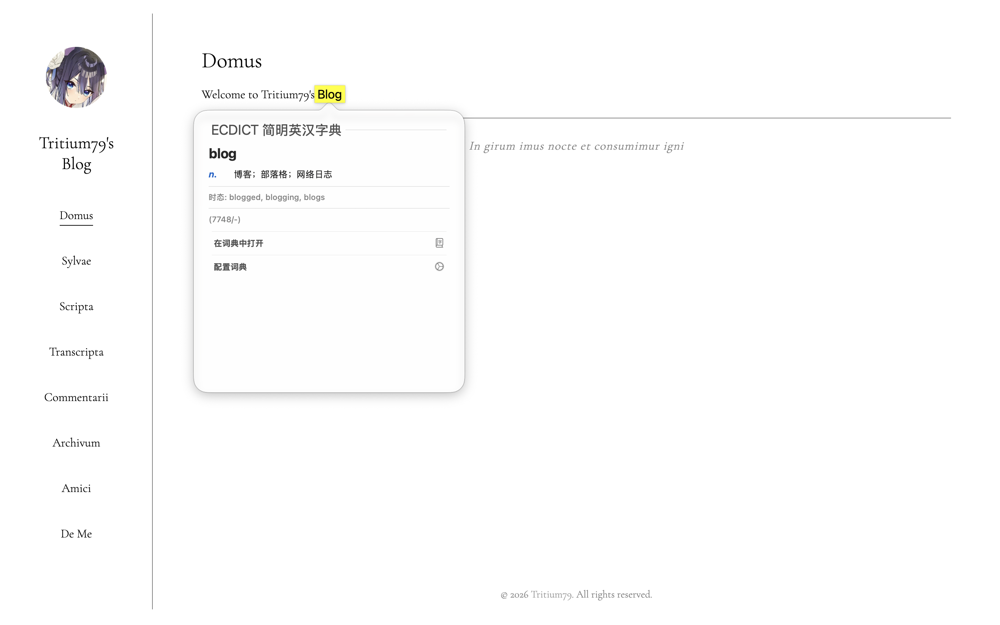
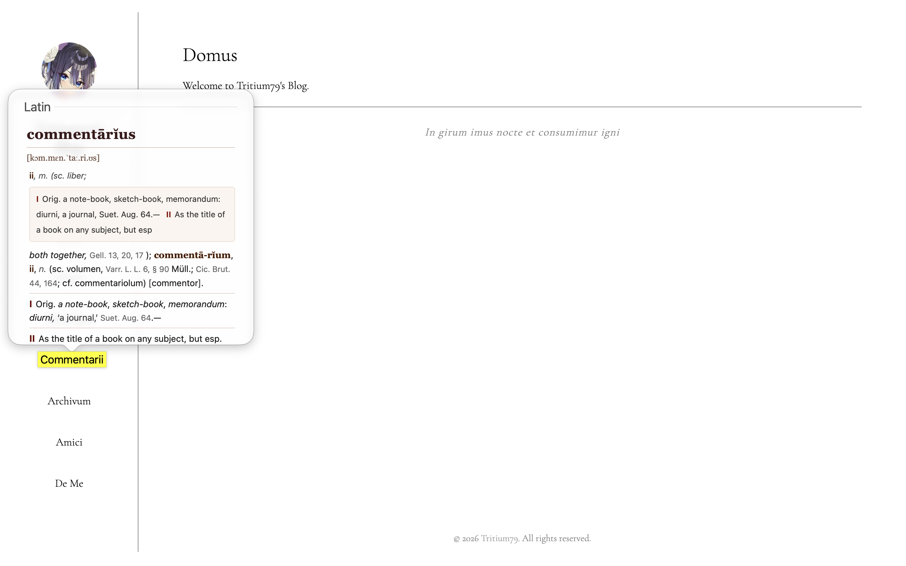

拉丁文-英文：[Josolon/latin-dictionary](https://github.com/Josolon/latin-dictionary)
英文-简体中文：[343534-code/ecdict-macos-dictionary](https://github.com/343534-code/ecdict-macos-dictionary)

均为社区制作词典，用于macOS原生软件Dictionary App。
把`.dictionary`文件夹移动至`~/Library/Dictionaries/`，再于Dictionary App中勾选，即可使用。

效果

